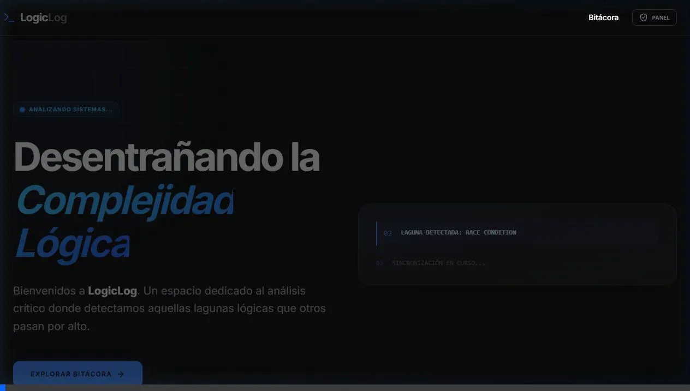

# LogicLog | Arquitectura de Software Premium (Full-Stack Edition)

LogicLog es una plataforma de análisis crítico y divulgación técnica dedicada a la ingeniería de software con rigor analítico. Desde **Oruro, Bolivia**, este blog explora las lagunas lógicas, condiciones de carrera y fallos de arquitectura en sistemas complejos.

> [!TIP]
> **Pre-visualización Visual**: Para una galería completa de capturas de pantalla del sistema operativo, por favor consulta el archivo [walkthrough.md](file:///C:/Users/Virtual%20System/.gemini/antigravity/brain/6865b0c4-6d9f-4429-bcca-1920393404e5/walkthrough.md) generado en los artefactos.

## 🚀 Stack Tecnológico

El proyecto ha evolucionado a una arquitectura **Full-Stack** robusta:

### **Frontend**
*   **Vite + React**: Reactividad extrema y tiempos de carga mínimos.
*   **Tailwind CSS v4**: Motor de diseño de última generación para una fidelidad estética absoluta.
*   **Framer Motion**: Animaciones fluidas y transiciones de página inmersivas.
*   **Lucide-React**: Iconografía técnica y minimalista.

### **Backend & Persistencia**
*   **Node.js + Express**: Servidor de API RESTful para la gestión de datos.
*   **Prisma ORM**: Capa de abstracción de base de datos moderna y segura (Type-safe).
*   **SQLite**: Base de datos local eficiente (arquitectura preparada para migrar a **Supabase/PostgreSQL**).

## 🛠️ Funcionalidades Core

*   **Navegación Full-Page**: Experiencia de lectura inmersiva sin distracciones.
*   **Panel Administrativo (Modo Operativo)**:
    *   Protección mediante código de acceso técnico (`LOGICLOG2026`).
    *   Gestión CRUD completa: Crear, Leer, Editar y Eliminar publicaciones.
*   **Interacciones en Tiempo Real**:
    *   Sistema de comentarios persistente sincronizado vía API.
    *   Contador de Reacciones (Likes) persistente.

## 🛡️ Acceso Administrativo
El acceso al panel de control se realiza mediante el botón **"Panel"** en la cabecera.
> [!IMPORTANT]
> **Código de Autorización Operativa**: `LOGICLOG2026`

---
*LogicLog © 2026 // ANALYZING_SYSTEMS_CONTINUOUSLY*
*Arquitectura de Software boliviana para el mundo.*
